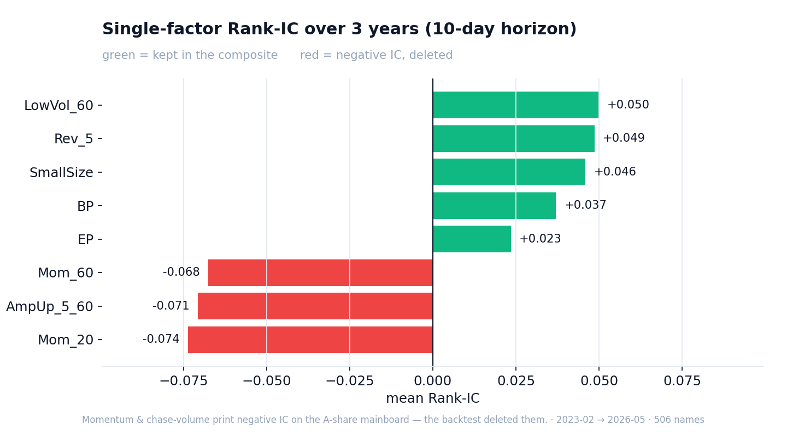
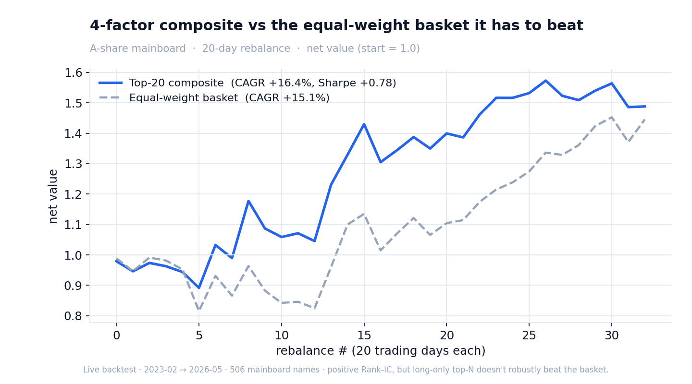

# Trade Review

> Your personal AI trading coach — multi-market, self-hosted, with Claude OAuth or DeepSeek API.

[](LICENSE)
[](https://www.python.org/)
[](https://fastapi.tiangolo.com/)
[](https://react.dev/)
[](README.zh-CN.md)

Trade Review turns each of your trades into a structured coaching loop:
**flash review** the moment you click buy/sell, **end-of-day review** of every
position, **weekly mindset radar** showing your behavioral patterns, and a full
**trade journal** with rule-tagged context. Covers A-share, HK and US markets.

It runs on your laptop and supports multiple AI connection modes: reuse your
local Claude Code OAuth login with no Anthropic API key, or bring a DeepSeek API
key through an OpenAI-compatible adapter.

> ⚠️ **Disclaimer.** This is a personal journaling and coaching tool. Nothing
> it produces is investment advice. The AI can be wrong about prices, dates,
> and fundamentals — always verify before acting.

---

## Screenshots

The [Quantitative engine](#quantitative-engine) section below has live backtest
charts. App UI screenshots (Dashboard / Flash / Weekly mindset) are coming soon —
generate your own with `scripts/screenshot.sh`.

---

## Features

- 🔥 **Flash review (≤10 s)** — paste a trade, get a JSON-structured score on
  timing / mindset / technicals plus three forward scenarios with probabilities.
- 📋 **Daily portfolio review** — streamed per-position recommendations with
  technical levels, fundamentals, and risk notes.
- 🧭 **Weekly mindset radar** — 6-axis scorecard (discipline, emotion, patience,
  autonomy, risk-control, learning) computed from your tagged trade history.
- 🧪 **Quantitative engine** — a multi-factor A-share stock screener with a
  *real* vectorized backtest (Rank-IC, quantile groups, non-overlapping Top-N,
  walk-forward) over 3 years of data, plus a pluggable strategy registry so you
  can drop in and backtest your own factor mix. The numbers below are
  reproducible from the repo — including the ones that don't flatter it.
- 🏷️ **Rule-based behavioral tags** — built-in detectors for chasing tops,
  panic selling, revenge trades, over-trading, counter-trend entries, etc.
- 📊 **Multi-market quotes** — A-share via [akshare](https://github.com/akfamily/akshare),
  HK / US via [yfinance](https://github.com/ranaroussi/yfinance), with
  automatic fallbacks.
- 🤖 **Pluggable AI engine** — Claude Sonnet 4.6 through local Claude Code
  OAuth, or DeepSeek via API key.
- 🔒 **Single-user auth** — auto-generated 24-char access token, optionally
  served only over your private [Tailscale](https://tailscale.com/) mesh.

---

## Quantitative engine

Most "quant" repos show you the one backtest that worked. This one ships the
backtest that **kept me honest** — momentum and chase-volume factors looked
great in theory and printed *negative* Rank-IC on the A-share mainboard, so the
code deleted them.

Every number here is computed live from 3 years of local A-share data
(2023-02 → 2026-05, 506 mainboard names). Regenerate it all with:

```bash
.venv/bin/python -m backend.quant.backtest        # factor IC + composite report
.venv/bin/python scripts/make_backtest_charts.py  # the two charts below
```

### What the factors actually predict



The four factors that survived (short-term reversal, low volatility, value/BP,
small-cap) are equal-weighted into `multifactor_v1`. Composite Rank-IC, full
sample:

| Horizon | Rank-IC | ICIR | IC > 0 | Top-20 CAGR | Sharpe | Equal-weight basket |
|--------:|--------:|-----:|-------:|------------:|-------:|--------------------:|
| 5d  | +0.080 | +0.48 | 67% | +5.9%  | +0.41 | +13.8% |
| 10d | +0.088 | +0.54 | 71% | +5.0%  | +0.36 | +15.0% |
| 20d | +0.099 | +0.60 | 72% | +16.4% | +0.78 | +15.1% |

Walk-forward (pick factors on data **before** 2025-01-01, test after):
out-of-sample Rank-IC **+0.048**, IC>0 **61%** — the signal survives unseen data.

### The honest part



The cross-sectional **ranking is genuinely predictive** (positive IC that holds
up out-of-sample). But the long-only Top-20 portfolio does **not** robustly beat
a simple equal-weight basket — at short horizons it lags, and in the 2025 rally
the basket won outright. Positive IC ≠ a portfolio you should trade. The charts
show it instead of hiding it. (And per the disclaimer above: none of this is
investment advice.)

### Write your own strategy

A strategy is declarative — pick validated factors, weight them, set Top-N. Drop
a file in `backend/quant/strategies/` and it's auto-discovered on import:

```python
# backend/quant/strategies/my_strategy.py
from backend.quant.strategies import Strategy, register

register(Strategy(
    name="my_reversal",
    description="reversal-tilted, low-vol filtered",
    factors=["Rev_5", "LowVol_60", "SmallSize"],
    weights={"Rev_5": 2.0},   # factors not listed default to weight 1.0
    top_n=15,
))
```

Then backtest it, screen with it, or call it over HTTP:

```bash
.venv/bin/python -m backend.quant.backtest --list                 # list strategies
.venv/bin/python -m backend.quant.backtest --strategy my_reversal # IC / Sharpe / vs benchmark
.venv/bin/python scripts/quant_run_today.py --strategy my_reversal # today's Top-N picks
# or: GET /api/quant/strategies   ·   POST /api/quant/run {"strategy": "my_reversal"}
```

> Factors available: `Rev_5`, `LowVol_60`, `BP`, `SmallSize`, `EP`. Momentum and
> chase-volume are intentionally excluded — the backtest showed they hurt.

---

## Architecture

```
┌──────────────────────────────────────────────────────────────┐
│   React 19 + TypeScript + Tailwind  (single-port SPA)        │
│   Dashboard · Flash · Daily · Mindset · Journal              │
└────────────────────────┬─────────────────────────────────────┘
                         │  REST + Server-Sent Events
                         ▼
┌──────────────────────────────────────────────────────────────┐
│   FastAPI                                                    │
│  ┌────────────────────────────────────────────────────────┐  │
│  │  Flash · Daily · Chat · Mindset · Trades · Positions   │  │
│  └────────────────────────────────────────────────────────┘  │
│  ┌─────────────┐  ┌──────────────────┐  ┌────────────────┐   │
│  │ MindsetRule │  │ MarketAggregator │  │ AIEngine       │   │
│  │ (7 tags)    │  │ akshare/yfinance │  │ (persistent    │   │
│  │             │  │ + iFinD optional │  │  warm session) │   │
│  └─────────────┘  └──────────────────┘  └────────────────┘   │
│  ┌────────────────────────────────────────────────────────┐  │
│  │ QuantEngine: factors / backtest / pluggable strategies   │  │
│  └────────────────────────────────────────────────────────┘  │
│  ┌────────────────────────────────────────────────────────┐  │
│  │                    SQLite                              │  │
│  │  trades · positions · reviews · mindset_tags · weekly  │  │
│  └────────────────────────────────────────────────────────┘  │
└──────────────────────────────────────────────────────────────┘
```

---

## Quick start

```bash
# 0. Prerequisites
#    - macOS or Linux
#    - Python 3.11+
#    - Node.js 20+
#    - AI engine:
#      Claude mode:   npm i -g @anthropic-ai/claude-code && claude
#      DeepSeek mode: set DEEPSEEK_API_KEY in .env

# 1. Clone & install
git clone https://github.com/hjjbh1314/trade-review
cd trade-review
python3 -m venv .venv
.venv/bin/pip install -r requirements.txt

# 2. (Optional) Customise
cp .env.example .env
# edit .env to set TR_USER_NAME and optionally switch TR_AI_ENGINE

# 3. Start
./start.sh
# → opens http://127.0.0.1:8090/#token=<auto-generated>
```

The first run will:
1. Generate `.tr_token` (your access token, mode 600, gitignored)
2. `npm install` and build the frontend (`frontend/dist/`)
3. Check the selected AI engine configuration
4. Print a single URL with `#token=...` — open it once, the token is stored in
   `localStorage` for 7 days, after which only `http://127.0.0.1:8090` is needed.

### Multi-device mode (Tailscale)

To use the app from your phone or another laptop without exposing it to anyone
on the same Wi-Fi:

```bash
brew install --cask tailscale         # one-time
./start.sh --tailscale
```

The service binds to your Tailscale IP only. Any device logged into the same
Tailscale account can reach it; everyone else on the network cannot.

> ⚠️ The legacy `--lan` flag has been removed by design. Binding `0.0.0.0` on
> public Wi-Fi (school, café, airport) would expose your positions to anyone
> who scans the port. Use Tailscale.

---

## Configuration

All configuration is via environment variables. Copy `.env.example` to `.env`
and edit:

| Var | Default | Effect |
|---|---|---|
| `TR_USER_NAME` | _(empty)_ | Name the AI coach addresses you by in prompts. Falls back to "the trader". |
| `VITE_USER_NAME` | mirrors `TR_USER_NAME` | Same name shown in the top nav (build-time injected). |
| `TR_AI_ENGINE` | `claude` | Engine selector. `claude` uses local Claude Code OAuth; `deepseek` uses API key. |
| `DEEPSEEK_API_KEY` | _(empty)_ | Required when `TR_AI_ENGINE=deepseek`. |
| `DEEPSEEK_MODEL` | `deepseek-chat` | DeepSeek model name. Use `deepseek-reasoner` if you prefer the reasoning model. |
| `DEEPSEEK_BASE_URL` | `https://api.deepseek.com` | OpenAI-compatible chat completions base URL. |
| `IFIND_AUTH_TOKEN` | _(empty)_ | Optional iFinD MCP token for richer A-share enrichment. The app works without it. |

`TR_ACCESS_TOKEN` is generated automatically by `start.sh` and persisted in
`.tr_token`. To rotate it, delete `.tr_token`.

---

## Project layout

```
trade_review/
├── backend/                       FastAPI app
│   ├── main.py                    entrypoint, lifespan, CORS, routes
│   ├── auth.py                    token middleware (header / cookie / query)
│   ├── api/                       routers
│   │   ├── flash.py               POST /api/flash/review/stream  (SSE)
│   │   ├── daily.py               POST /api/daily/review/stream  (SSE)
│   │   ├── chat.py                POST /api/chat/message/stream  (SSE)
│   │   ├── mindset.py             GET  /api/mindset/weekly
│   │   ├── positions.py           CRUD + /with-quotes
│   │   ├── market.py              GET  /api/market/kline (MA5/MA20)
│   │   └── trades.py              CRUD + /journal
│   ├── ai/                        AI engine adapter
│   │   ├── claude_engine.py       persistent ClaudeSDKClient session
│   │   ├── deepseek_engine.py     OpenAI-compatible DeepSeek adapter
│   │   └── prompts.py             flash & daily templates
│   ├── market/
│   │   ├── aggregator.py          akshare + yfinance + JSON sanitiser
│   │   └── ifind_adapter.py       optional enrichment
│   ├── mindset/
│   │   ├── rule_engine.py         7-tag detector
│   │   └── weekly.py              6-axis radar
│   ├── quant/                     multi-factor screener + backtest
│   │   ├── factors.py             validated factor library (z-score composite)
│   │   ├── backtest.py            Rank-IC / groups / Top-N / walk-forward
│   │   ├── signals.py             strategy → Top-N buy signals
│   │   ├── strategies/            pluggable strategy registry (+ your own)
│   │   └── paper_trader.py        paper fills into the trades table
│   └── db/
│       ├── schema.sql
│       └── repo.py                SQLite access
├── frontend/                      Vite + React 19 + Tailwind 3
│   └── src/{pages,components,api.ts}
├── data/                          (gitignored) your SQLite db
├── start.sh                       one-shot starter
├── DESIGN.md                      design doc
└── README.md / README.zh-CN.md
```

---

## API reference

Open `http://127.0.0.1:8090/docs` after starting the server for an
auto-generated, interactive OpenAPI page.

Selected endpoints:

| Method | Path | Purpose |
|---|---|---|
| `POST` | `/api/flash/review/stream` | Flash review SSE — streaming AI verdict on a single trade |
| `POST` | `/api/daily/review/stream` | Daily portfolio review SSE |
| `POST` | `/api/chat/message/stream` | Free-form Q&A with the coach (focused on a position) |
| `GET`  | `/api/mindset/weekly?week=2026-W17` | 6-axis radar + top errors + AI message |
| `GET`  | `/api/positions/with-quotes` | Positions enriched with live last/PnL |
| `GET`  | `/api/market/kline?symbol=600519&market=A&period=daily&limit=120` | OHLCV + MA5/MA20 |
| `GET`  | `/api/quant/strategies` | List registered quant strategies |
| `POST` | `/api/quant/run` | Run a strategy → Top-N signals (`{strategy, top_n, paper}`) |

All `/api/*` routes (except `/api/health` and `/api/auth-status`) require the
access token via:

- Header: `X-TR-Token: <token>`
- Cookie: `tr_token=<token>`
- Query: `?token=<token>`

---

## Tech stack

- **Backend**: Python 3.11+, FastAPI, SQLite, asyncio
- **AI**: Pluggable adapters: Claude Sonnet 4.6 via
  [`claude-agent-sdk`](https://github.com/anthropics/claude-agent-sdk-python)
  using local Claude Code OAuth, or DeepSeek via OpenAI-compatible API
- **Market data**: [akshare](https://github.com/akfamily/akshare) (A-share),
  [yfinance](https://github.com/ranaroussi/yfinance) (HK/US),
  optional iFinD MCP
- **Frontend**: React 19, TypeScript, TailwindCSS, Vite,
  [lightweight-charts](https://github.com/tradingview/lightweight-charts)
- **Networking**: optional [Tailscale](https://tailscale.com) for safe
  multi-device access

---

## Roadmap

- [x] Quant engine: multi-factor screener + vectorized backtest (IC / groups / walk-forward)
- [x] Pluggable strategy registry — drop in and backtest your own factor mix
- [x] Pluggable AI engines: Claude OAuth / DeepSeek API
- [ ] Surface the quant signals & backtest in the React UI (currently API/CLI only)
- [ ] Industry-neutralized factors (SH industry field still missing)
- [ ] Sector / index aggregation for the daily report
- [ ] Historical T+1/T+3/T+5 outcome tracking (`trade_outcomes` table is ready)
- [ ] Optional Postgres backend for multi-user
- [ ] App UI screenshots & video walkthrough

---

## Contributing

Issues and pull requests welcome. Please:

1. Open an issue first for non-trivial changes so we can scope it.
2. Keep PRs focused — one fix or one feature per PR.
3. Run `npm run build` and try the changed flow locally before pushing.

---

## License

[MIT](LICENSE)

---

## Acknowledgements

- [Anthropic Claude](https://www.anthropic.com/) for the model and the open
  Agent SDK.
- [akshare](https://github.com/akfamily/akshare) and
  [yfinance](https://github.com/ranaroussi/yfinance) for free market data.
- [TradingView lightweight-charts](https://github.com/tradingview/lightweight-charts)
  for the K-line component.
